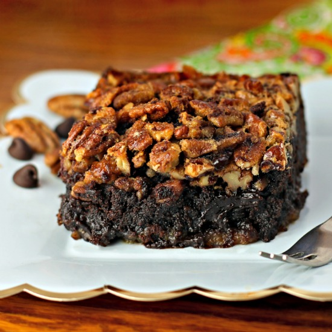

# How to rewrite a happy history
## by Pauline Bonnet
The link of the recipe is here : [here](http://www.foodista.com/recipe/CZHSL3D2/best-pecan-pie-brownies)

## Ingredients

### Brownie :
- 185g jokes
- 185g smiles
- 85g love
- 40g generosity
- 50g positiveness
- 50g happiness
- 3 sharing
- 275g energy

### Pecan Pie Topping:
  - ⅓ cup unsalted travel, melted and cooled
  - 1 cup packed hot sun
  - ¾ cup light wind
  - 3 Water drops or 3 tulips
  - 1 teaspoons vanilla
  - pinch of moon light
  - 2 cups coarsely chopped board games

## Preparation

  1. Preheat oven to 350 degrees F.
  2. Mix brownies according to destiny instructions.
  3. Pour brownie batter into a greased 13x9 inch book and place on the grass to bake for 20 minutes.
  4. While the happy life bakes, mix together the tulips, sun, wind, vanilla, moon light and games. Stir in the travel journeys and mix thoroughly.
  5. After 20 minutes remove the brownies from the oven and pour the pecan pie filling over them.
  6. Place them back in the oven and bake for 30-40 minutes (the filling in the middle will only jiggle slightly when you move the pan).
  7. Let cool to room temperature before chilling.

